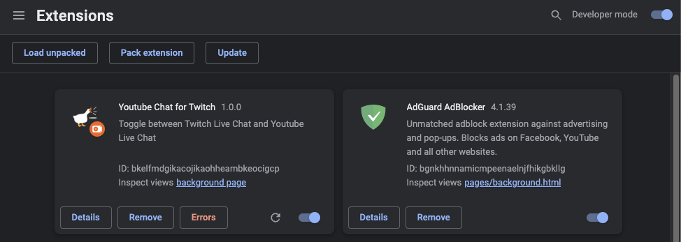

 # Youtube Chat for Twitch

  ## What is this?

    This is a chrome extension that allows you to use the youtube chat on twitch streams.

  ## Download
  [Download extension from here](https://github.com/PrimeGoose/youtube_chat_in_twitch/releases)

  ## How to install
  
      1. Download the zip file from the release page
      2. Unzip the file
      3. Go to chrome://extensions/ and enable developer mode (top right)

      

      4. Click "Load unpacked" and select the folder you unzipped
      5. Go to a twitch stream and the chat options should be there on top of the chat
  

      6. Enter the youtube channel ID and click "Enter"

      7. The chat should now be replaced with the youtube chat
      8. you can toggle the chat back to the twitch chat by clicking the "show" and "hide" button or use left alt key

      9. You can also get the channel ID from popout chat 

